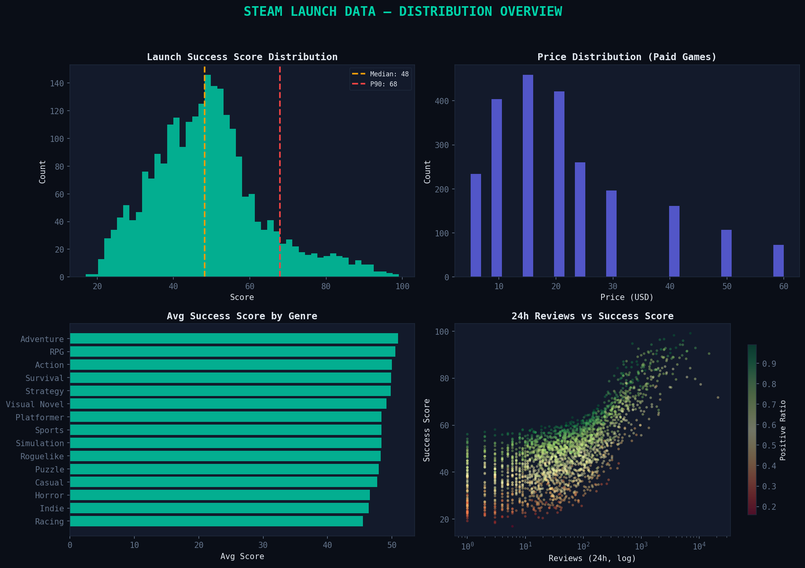
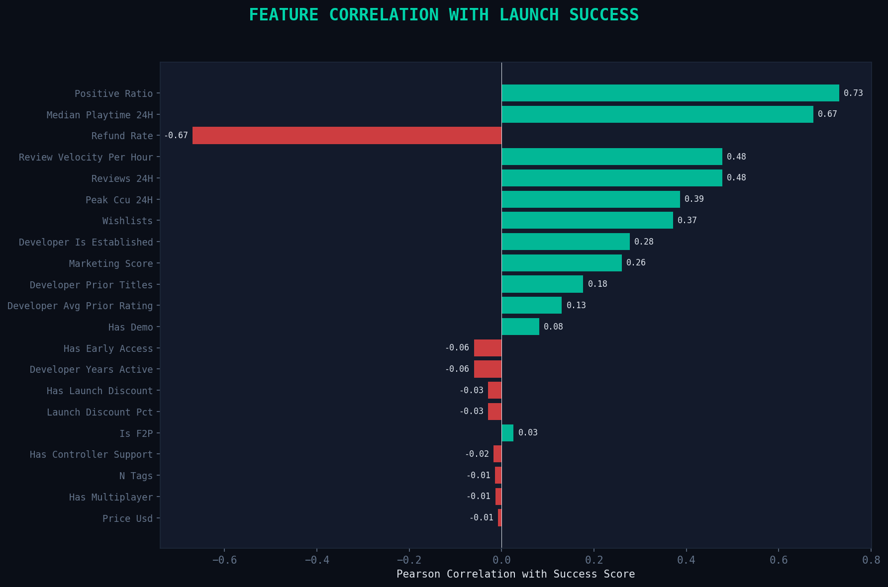
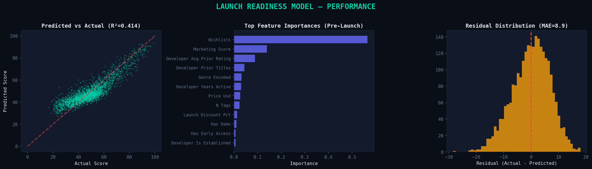
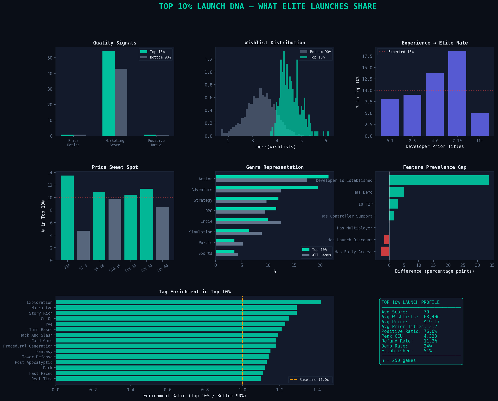

# 🎮 Steam Launch Success Predictor

**Can we predict a game's launch success using pre-launch signals?**


A data analysis project that builds a **Launch Readiness Score** from pre-launch signals — price, genre, developer history, tag profile, wishlists, and marketing presence — then identifies what the **top 10% of Steam launches** have in common.

---

## 📊 Key Findings

| Signal | Top 10% | Bottom 90% | Multiplier |
|--------|---------|------------|------------|
| Avg Wishlists | 63,406 | 5,250 | **12.1x** |
| Positive Review Ratio | 76% | 63% | 1.2x |
| Established Studio Rate | 51% | 22% | 2.3x |
| Refund Rate | 11% | 16% | 0.7x |
| Marketing Score | 54 | 43 | 1.3x |

### The "Elite Launch" Profile
1. **Wishlists are the #1 predictor** — accounting for 56.5% of model importance
2. **Developer track record matters** — prior rating and title count are the 3rd/4th strongest signals  
3. **Marketing amplifies quality** — a 25% higher marketing score separates top from average
4. **Early Access hurts perception** — only 3% of elite launches used the EA tag
5. **Demos signal confidence** — 24% of top launches offered a demo vs 19% overall

---

## 🔬 Methodology

### Data Pipeline
```
[Synthetic Data Generation] → [Feature Engineering] → [EDA] → [Modeling] → [Top 10% Analysis]
         2,500 games            50+ features          6 charts   GBR model    Statistical tests
```

### Launch Success Score (Target Variable)
Composite score (0-100) weighted across five 24-hour post-launch metrics:

| Component | Weight | Metric |
|-----------|--------|--------|
| Review Sentiment | 30% | Positive review ratio |
| Review Volume | 20% | Total reviews (normalized) |
| Player Engagement | 20% | Peak concurrent users |
| Retention Signal | 15% | Median playtime |
| Low Refund Rate | 15% | Inverse refund rate |

### Predictive Model
- **Algorithm:** Gradient Boosting Regressor (300 trees, depth 5)
- **Features:** Pre-launch only (no data leakage from post-launch metrics)
- **Validation:** 5-fold stratified cross-validation
- **Performance:** R² = 0.414, MAE = 8.89

### Statistical Analysis
- Mann-Whitney U tests for top 10% vs rest comparisons
- Tag enrichment analysis (frequency ratio)
- Genre over-representation indexing

---

## 📁 Project Structure

```
steam-launch-predictor/
├── README.md
├── requirements.txt
├── data/
│   └── steam_launches.csv          # 2,500 synthetic game records
├── notebooks/
│   └── analysis_walkthrough.ipynb  # Step-by-step narrative walkthrough
├── src/
│   ├── generate_data.py            # Synthetic data generator with realistic correlations
│   └── analyze.py                  # Full analysis pipeline (EDA → Model → Insights)
└── outputs/
    ├── 01_eda_distributions.png    # Distribution overview
    ├── 02_temporal_pricing.png     # Temporal & pricing patterns
    ├── 03_feature_correlations.png # Feature correlation rankings
    ├── 04_correlation_heatmap.png  # Top-10 feature heatmap
    ├── 05_model_performance.png    # Model diagnostics
    ├── 06_top10_dna.png            # Elite launch deep-dive (9 panels)
    ├── analysis_report.txt         # Executive summary report
    └── analysis_summary.json       # Machine-readable results
```

---

## 📈 Visualizations

### Distribution Overview


### Feature Correlations


### Model Performance


### Top 10% Launch DNA


---

## 🚀 Quick Start

```bash
# Clone the repo
https://github.com/Why-not-techno/Steam-Launch-Success-Predictor.git
cd steam-launch-predictor

# Install dependencies
pip install -r requirements.txt

# Generate the dataset
python src/generate_data.py

# Run the full analysis
python src/analyze.py
```

All visualizations and reports will be saved to `outputs/`.

### Interactive Walkthrough

```bash
jupyter notebook notebooks/analysis_walkthrough.ipynb
```

The notebook provides a narrative walkthrough with inline visualizations — ideal for reviewing the methodology step by step.

---

## 💡 Skills Demonstrated

| Skill | Application |
|-------|-------------|
| **Exploratory Data Analysis** | Distribution analysis, temporal patterns, pricing segmentation |
| **Feature Engineering** | Tag one-hot encoding, composite scoring, developer history aggregation |
| **Statistical Testing** | Mann-Whitney U tests, enrichment ratios, significance thresholds |
| **Machine Learning** | Gradient Boosting, cross-validation, feature importance, residual analysis |
| **Data Visualization** | Multi-panel dashboards, correlation heatmaps, comparison charts |
| **Python** | pandas, scikit-learn, matplotlib, seaborn, scipy |
| **Storytelling** | Translating model outputs into actionable launch readiness checklist |

---

## 🔮 Future Work

- [ ] Integrate real Steam API data via SteamSpy / SteamDB
- [ ] Add NLP analysis of store page descriptions and trailers
- [ ] Build an interactive Streamlit dashboard
- [ ] Time-series analysis of review velocity curves
- [ ] A/B test different launch strategies via simulation

---

## 📝 Notes on Data

This project uses **synthetic data** generated to mirror realistic distributions observed in Steam marketplace research. The data generator (`src/generate_data.py`) creates correlated features that reflect real-world patterns: developer experience correlating with review scores, wishlists predicting launch volume, and genre-specific tag profiles.

The methodology and analytical framework are designed to transfer directly to real Steam data when API access is available.

---

## License

MIT License — see [LICENSE](LICENSE) for details.
